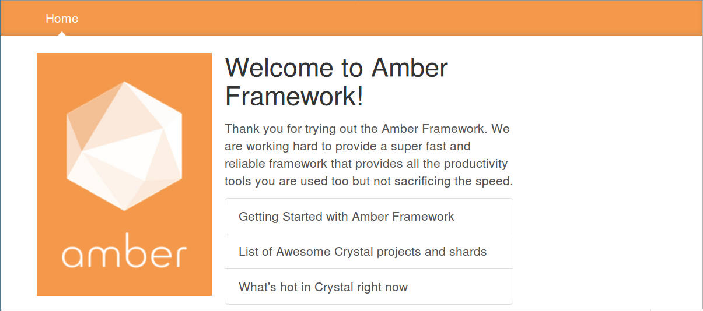

# Initial App Setup

## Installation Dependancies
----

For Docker-compose, see:

* https://docs.docker.com/compose/install/#install-compose

For Amber, see:

* https://github.com/amberframework/amber

### Example local setup

```sh
sudo apt-get install build-essential libreadline-dev libsqlite3-dev libpq-dev libmysqlclient-dev libssl-dev

# pip uninstall docker-py; pip uninstall docker; pip install docker
sudo curl -L https://github.com/docker/compose/releases/download/1.17.1/docker-compose-`uname -s`-`uname -m` -o /usr/local/bin/docker-compose
sudo chmod +x /usr/local/bin/docker-compose
docker-compose --version # => docker-compose version 1.17.1, build 6d101fb

cd $LOCAL_DEV_FOLDER_ROOT
mkdir amberframework
cd amberframework

git clone git@github.com:amberframework/amber.git
cd amber/

# Crystal version matching what is noted in 
#  e.g.: one of the below echo commands
echo "0.23.1" > .crystal-version # ... if you have 0.23.1 installed via crenv
echo "system" > .crystal-version # and have Crystal v 0.23.1 installed outside crenv

shards install
make install

```

## Initial creation of your Amber-scaffolded application
----

```sh
cd $LOCAL_DEV_FOLDER_ROOT
cd $MY_PROJECTS_SUB_ROOT

amber new example_app_amber -d pg -t slang --deps
cd example_app_amber

# Crystal version matching what is noted in 
#  e.g.: one of the below echo commands
echo "0.23.1" > .crystal-version # ... if you have 0.23.1 installed via crenv
echo "system" > .crystal-version # and have Crystal v 0.23.1 installed outside crenv

shards install
```

## Dockerized
----

### Build Docker images

```sh
docker-compose build

docker-compose

```

### (As needed) Cleanup ALL docker images and containers

**WARNING, this is for "ALL"**

You might have to run these more than once until each command says something like `"docker <cmd>" requires at least 1 argument(s).`

#### Stop ALL containers

```sh
docker kill $(docker ps -q)
```

#### Remove all containers

```sh
docker rm $(docker ps -a -q)
```

#### Remove all docker images

```sh
docker rmi -f $(docker images -q)
```

#### (or all together)

```sh
docker kill $(docker ps -q)
docker rm $(docker ps -a -q)
docker rmi -f $(docker images -q)
```

* View current services:

```sh
docker-compose config --services
```

### Launch the Docker containers

#### If you want to watch the STDIO of the docker containers:

In a separate terminal, type:

```sh
docker-compose up
```

* CTRL-c at any time should shut down the containers.

#### If you don't care to watch the STDIO of the docker containers:

In a terminal, type (to background it):

```sh
docker-compose up -d
```

* To shutdown the docker containers, type:

```sh
docker-compose stop app
```

### Verify that your docker containers are up and running

To view the running containers, type:

```sh
$ docker-compose ps
```

This should show something like:

```sh
$ docker-compose ps
          Name                         Command               State                 Ports
------------------------------------------------------------------------------------------------------
exampleappamber_app_1       amber watch                      Up       0.0.0.0:3000->3000/tcp
exampleappamber_db_1        docker-entrypoint.sh postgres    Up       5432/tcp
exampleappamber_mail_1      mailcatcher -f --ip 0.0.0.0      Up       1025/tcp, 0.0.0.0:1080->1080/tcp
exampleappamber_migrate_1   bash -c while ! nc -q 1 db ...   Exit 1
exampleappamber_web_1       bash -c npm install && npm ...   Up
```

## Browse your starter-app

```sh
bin/browse_web_app.sh
```

It should look like:



### Shell into your launched dockerized app

In your terminal for shelling into your dockerized app, type:

```sh
docker-compose exec app /bin/bash
```

... and then run your commands as needed, e.g.:

```sh
$ docker-compose exec app /bin/bash
root@52e3ac23eb0a:/app/local# pwd
/app/local
root@52e3ac23eb0a:/app/local# ls
Dockerfile  LICENSE  README.md  bin  config  docker-compose.yml  example_app_amber  initial-amber-web-app.png  lib  node_modules  package.json  public  scratch.sh  shard.lock  shard.yml  spec  src
```
