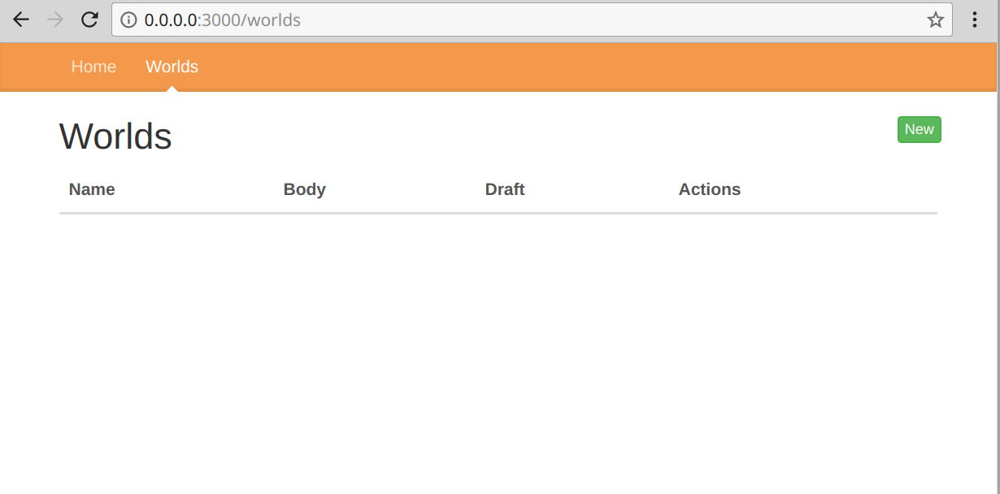
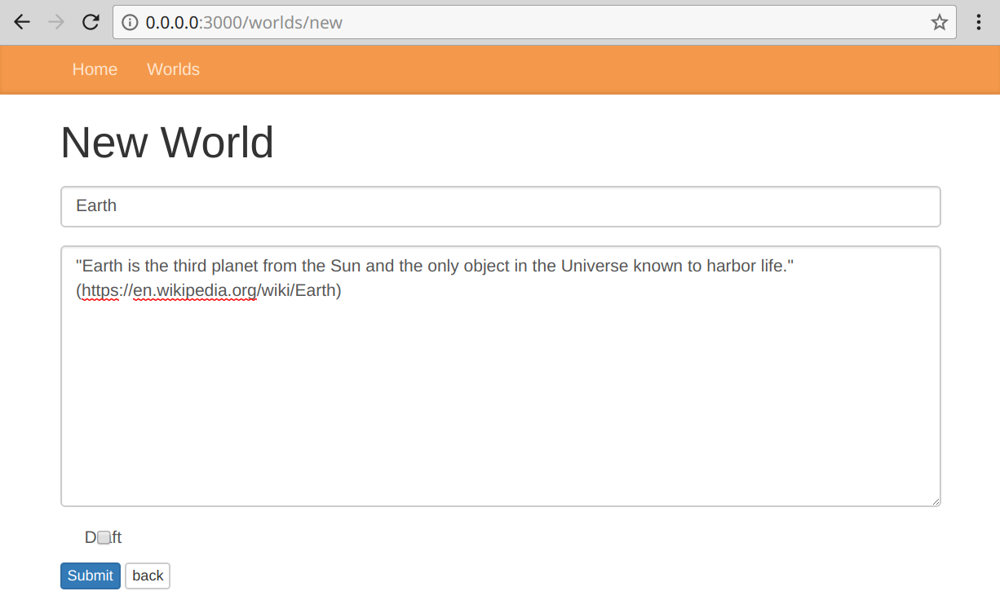
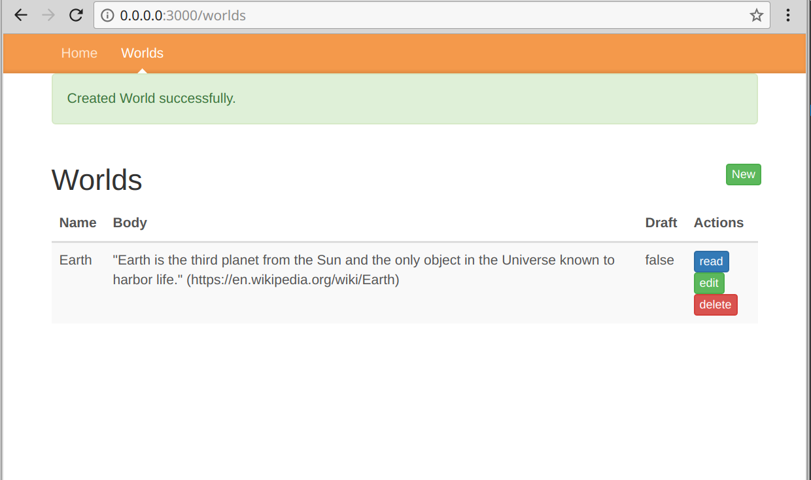

# Example "Hello World" list page

## Build and 'up' your app's containers. (See [a. initial_app_setup.md](a.initial_app_setup.md). )
----

In your terminal for shelling into your dockerized app, type:

```sh
docker-compose exec app /bin/bash
```

## Add a Hello 'World' page
----

### Create (Scaffold) a simple list page

In your app's docker shell, type:

```sh
amber generate scaffold World name:string body:text draft:bool
```

In your docker shell, this will output a list of new or rewritten files:

```sh
root@8e729438f739:/app/local# amber generate scaffold World name:string body:text draft:bool
Rendering Scaffold world
new       db/migrations/20171113040215_create_world.sql
new       spec/models/spec_helper.cr
new       spec/models/world_spec.cr
new       src/models/world.cr
new       spec/controllers/world_controller_spec.cr
new       spec/controllers/spec_helper.cr
new       src/controllers/world_controller.cr
new       src/views/world/new.slang
new       src/views/world/_form.slang
new       src/views/world/index.slang
new       src/views/world/show.slang
new       src/views/world/edit.slang
rewritten src/views/layouts/_nav.slang
```

The scaffold also added a database migration, so we'll need to run that migration; otherwise, if you browse to your new page, you'll get an error.

### Migrate the database

In the previous tutorial ([a. initial_app_setup.md](a.initial_app_setup.md)), the database should have been created. If your's isn't, type:

```sh
amber db create migrate
```

To just run the migrations, type:

```sh
amber db migrate
```

In your docker shell, this will look like:

```sh
root@8e729438f739:/app/local# amber db migrate
Migrating db, current version: 0, target: 20171113040215
OK   20171113040215_create_world.sql
```

## View the Hello 'World' page
----

Now, you can browse to your [Worlds page](http://0.0.0.0:3000/worlds). It should look like:



Clicking "New" to add a "World" record will take you to the scaffold-generated form:



Clicking "Submit" should take you back to the "World" list page with a "Created World Successfully" message:



## Run the scaffold-generated specs

### In your docker shell, run your specs

```sh
crystal spec
```

### If you get an error like below:

```txt
Error in line 2: while requiring "./spec/controllers/world_controller_spec.cr"

in spec/controllers/world_controller_spec.cr:18: undefined method 'get'

      get "/worlds"
```

... then do ??? (TBD, see [error: `undefined method 'get'` in scaffolded specs #387](https://github.com/amberframework/amber/issues/387). )
